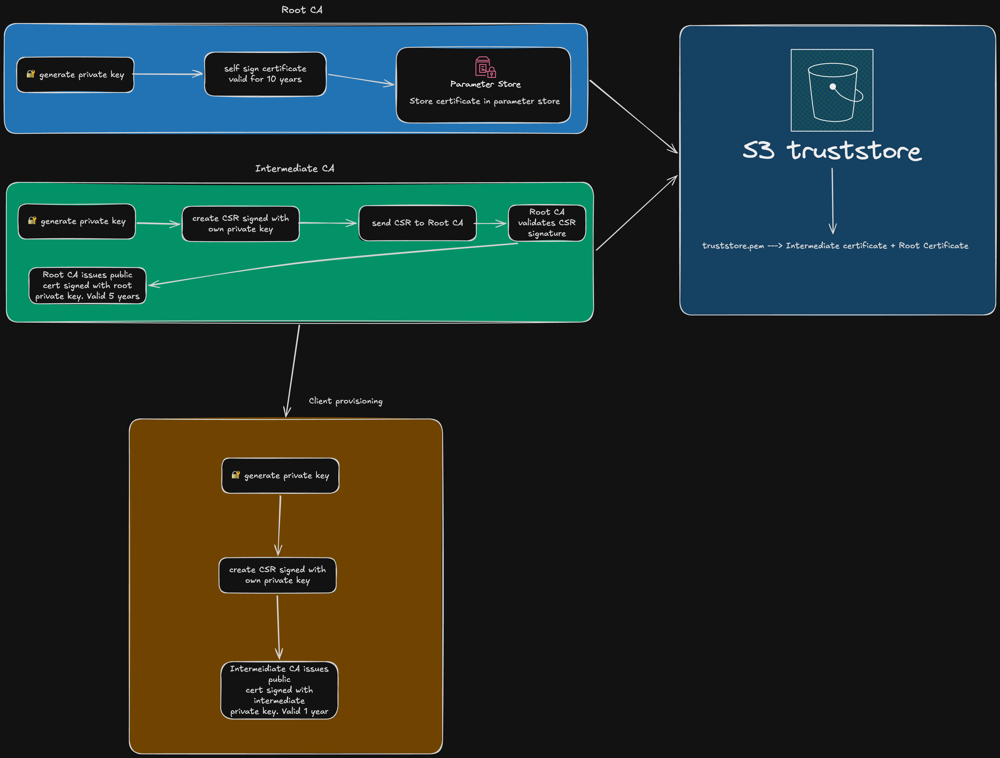

# CA Operations

Certificate authority operations using CSR-based PKI flow. Generates local artifacts for AWS provisioning.

## Business Logic

The script writes artifacts to `ca-operations/output` folder and Terraform provisions AWS resources storing certificates in Parameter Store, certificate chain in S3 truststore and certs metadata in DynamoDB.

**CSR-based PKI flow**:

- Requester creates private + public key pair
- Requester creates CSR with identity and public key encoded, signs the CSR with private key
- CA validates CSR signature (proves private key possession)
- CA extracts subject DN (distinguished name) and public key FROM CSR
- CA issues certificate without ever seeing requester's private key

## CA provisioning diagram



## Certificate Hierarchy

3-tier PKI:

- Root CA is self-signed, it's valid for 10yr, uses asymmetric encryption algotithm RSA 4096
- Intermediate CA is signed by Root CA via CSR flow, it's valid for 5yr, uses RSA 4096 and limits certificate chain depth to `pathlen: 0`.
- Client certs are signed by Intermediate CA via CSR, are valid for 395 days, and use RSA 4096

## Usage

How to run the script:

```bash
uv run ca_operations/scripts/bootstrap_ca.py --output-dir ca_operations/output

uv run ca_operations/scripts/create_truststore.py \
  --ca-dir ca_operations/output \
  --output ca_operations/output/truststore/truststore.pem
```

### Provision Client Certificates

```bash
uv run ca_operations/scripts/provision_client.py \
  --client-id api-client-001 \
  --ca-dir ca_operations/output \
  --output-dir ca_operations/output/clients
```

## Output Structure

```text
ca_operations/output/
├── root-ca/
│   ├── RootCA.key          # Root CA private key (Parameter Store)
│   ├── RootCA.pem          # Root CA certificate
│   └── metadata.json       # Serial, validity dates
├── intermediate-ca/
│   ├── IntermediateCA.key  # Intermediate CA private key (Parameter Store)
│   ├── IntermediateCA.pem  # Intermediate CA certificate
│   ├── IntermediateCA.csr  # CSR
│   └── metadata.json       # Serial, validity dates
├── truststore/
│   └── truststore.pem      # Chain bundle for S3 truststore
└── clients/
    └── api-client-001/
        ├── client.key      # Client private key (distribute to client)
        ├── client.pem      # Client certificate
        ├── client.csr      # CSR
        └── metadata.json   # For DynamoDB import
```

## Metadata Format

Serial numbers use UUID v4 for strong uniqueness guarantees.
Formatted as decimal integer string matching API Gateway serial number format.

```json
{
  "serialNumber": "302651828373057198556217564450567695063",
  "CN": "api-client-001",
  "notAfter": "2027-01-12T10:00:00+00:00",
  "status": "active",
  "issuedAt": "2025-12-13T10:05:12+00:00",
  "ttl": 1735992000
}
```

## Modules and utils

- `lib/config.py`: CAConfig, DistinguishedName dataclasses
- `lib/cert_utils.py`: Key generation, CSR validation/extraction, serialization, metadata generation
- `lib/certificate_builder.py`: CSR-based certificate building (build_root_ca, build_intermediate_ca, build_client_certificate)
- `lib/ca_manager.py`: CAManager orchestration (bootstrap_ca, create_truststore, provision_client_certificate)
- `lib/models.py`: BootstrapResult, ClientCertResult dataclasses
