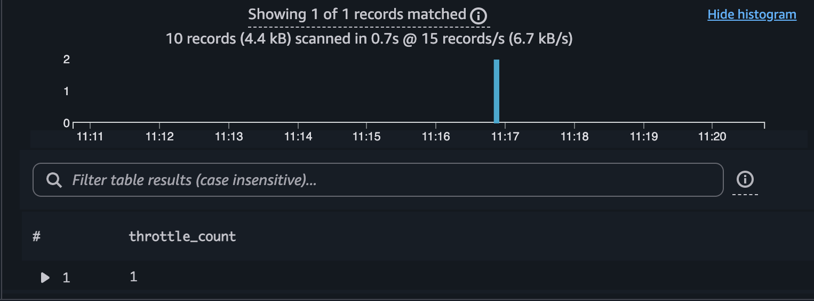
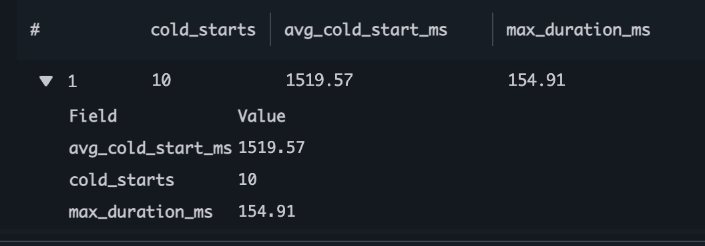
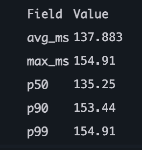
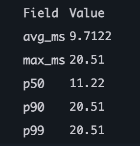
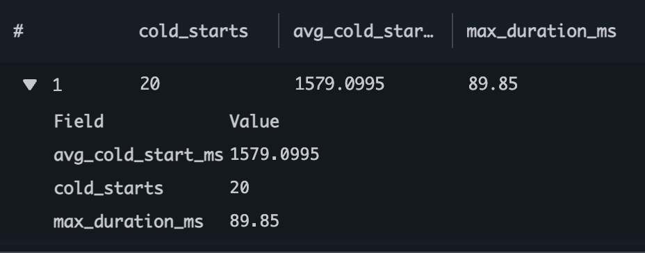
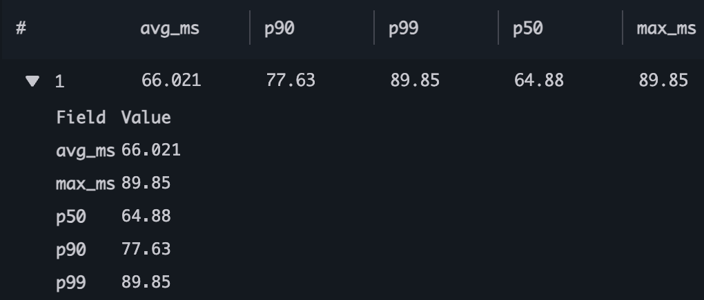
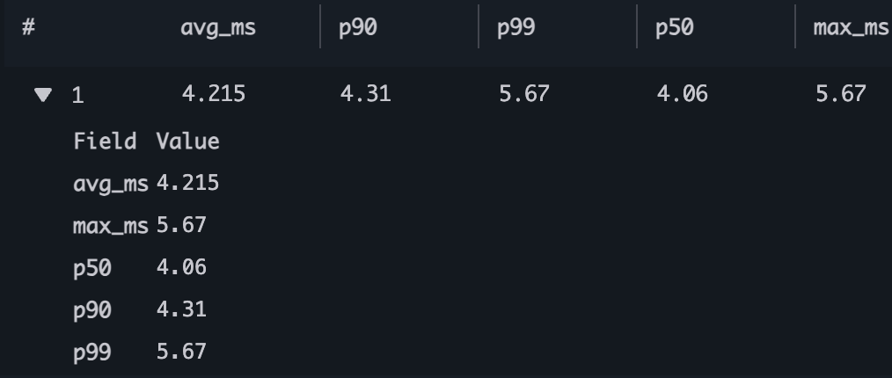

# Performance stats

I wanted to stress test the system to see how API Gateway and the lambdas perform under a small load.
Before running the test I ran `aws lambda get-account-settings | jq '.AccountLimit.ConcurrentExecutions'` to find out how many concurrent executions are enabled on my account by default, the result was 10.

## Concurrent Load test 256MB memory

Ran this bash command to send 10 concurrent requests:

```bash
for i in {1..10}; do make curl-health-verbose & done; wait
```

then ran these [queries in Cloudwatch](./CLOUDWATCH_INSIGHTS_QUERY.md)

Findings:

- One lambda got throttled once
  

- cold start of authorizer lambda
  

- cold start of health lambda
  

- latency of authorizer
  

- latency of health
  

The cold start of 1.5s average seems to be too high for a python lambda, the OTEL instrumentation is clearly adding a significant overhead. 256MB of memory might not be enough, I'll bump it up to 512MB and repeat the same test.

## Concurrent load 512MB memory

I repeated the same test triggering 10 concurrent requests bumping up the memory to 512MB and this fixed the throttling and errors. The cold start remained pretty much the same (1.5s) but the average latency is now halved, as expected.

I will repeat the test again disabling the OTEL instrumentation which should reduce the cold start time significantly.

Results below:

- cold start of both lambdas
  

- latency of authorizer
  

- latency of health
  
